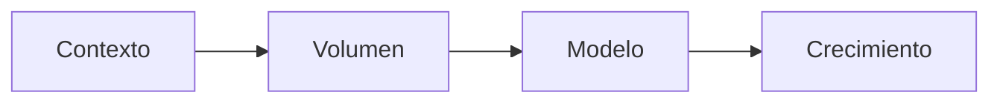
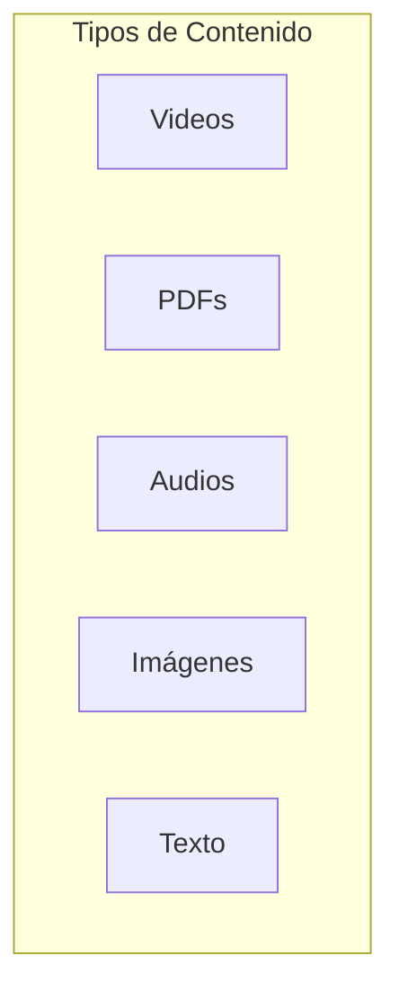
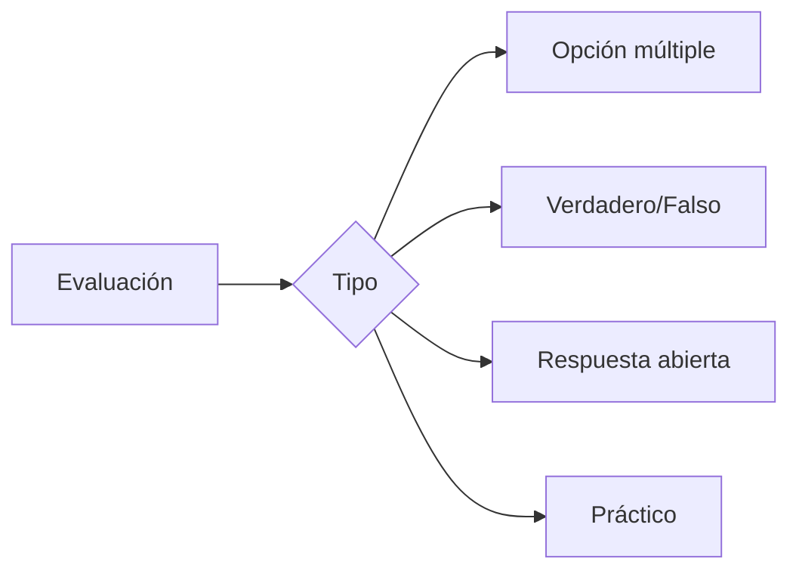
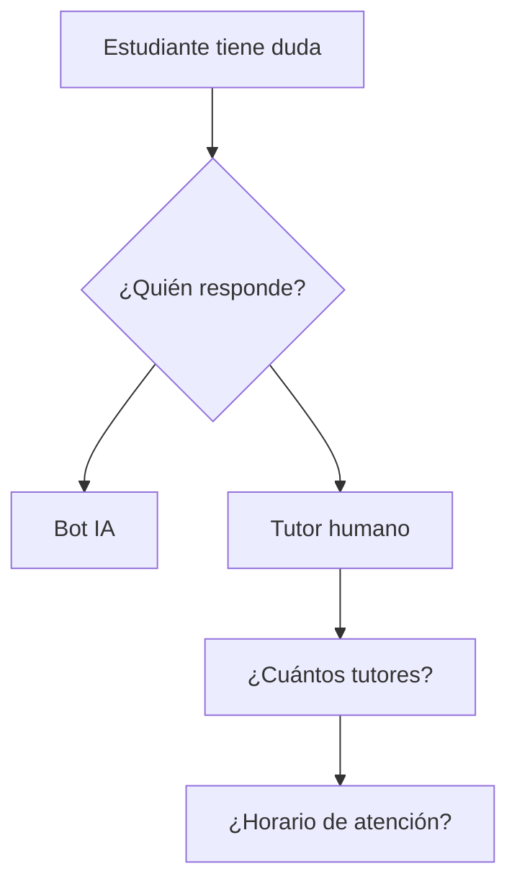
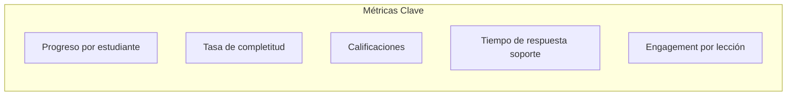
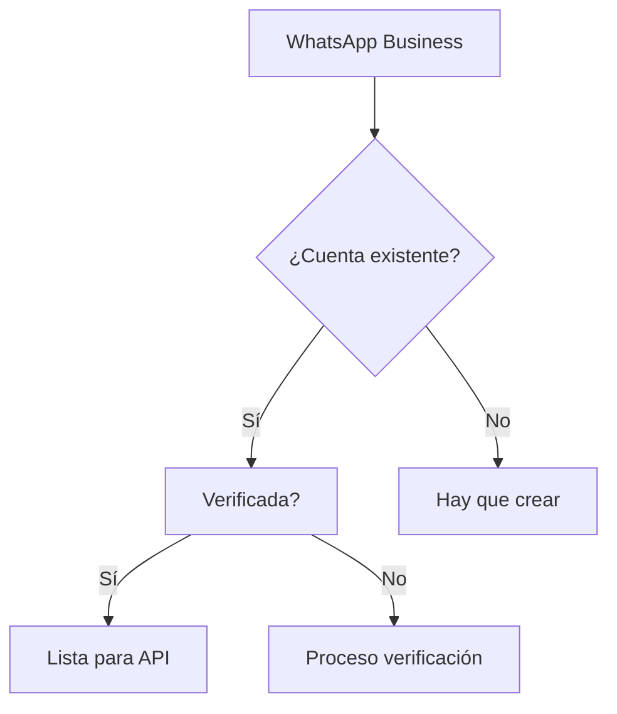
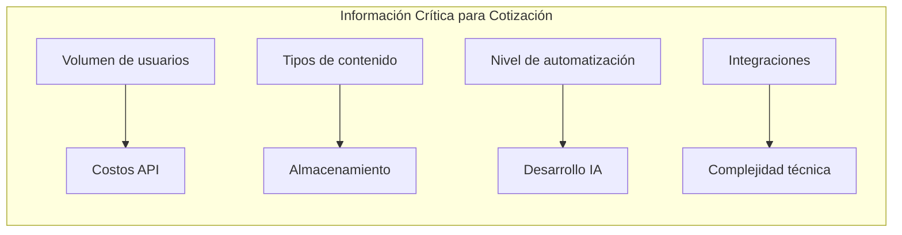

# Cuestionario para Levantamiento de Información

Este cuestionario debe completarse antes de iniciar el desarrollo del proyecto WhatsCourse. Las respuestas definirán el alcance técnico, costos e infraestructura necesaria.

---

## 1. Sobre el Negocio

| # | Pregunta | Notas |
|---|----------|-------|
| 1.1 | **¿Cuántas empresas clientes tienes actualmente?** | Define multi-tenancy |
| 1.2 | **¿Cuántos empleados en promedio tiene cada empresa cliente?** | Ej: 20, 50, 100+ |
| 1.3 | **¿Qué volumen de estudiantes esperas manejar en el primer año?** (50, 500, 5,000+) | Define infraestructura y costos de WhatsApp API |
| 1.4 | **¿Cuántos cursos diferentes ofreces actualmente?** | |
| 1.5 | **¿Un estudiante puede estar inscrito en varios cursos simultáneamente?** | |
| 1.6 | **¿Los cursos tienen fecha de inicio/fin o son evergreen (siempre disponibles)?** | |

---

## 2. Sobre el Contenido

| # | Pregunta | Notas |
|---|----------|-------|
| 2.1 | **¿Tienes ya contenido creado (videos, PDFs, audios)?** | |
| 2.2 | **¿En qué formatos está el contenido?** (MP4, PDF, MP3, etc.) | |
| 2.3 | **¿Cuál es el tamaño promedio de los archivos?** (Ej: videos de 5MB, 50MB, 200MB) | WhatsApp tiene límite de 16MB para medios |
| 2.4 | **¿Cuántas lecciones tiene un curso típico?** | |
| 2.5 | **¿Con qué frecuencia se enviarían las lecciones?** (Diario, cada 2 días, semanal) | |
| 2.6 | **¿El contenido incluye enlaces externos (YouTube, Vimeo, sitio web)?** | |

---

## 3. Sobre las Evaluaciones

| # | Pregunta | Notas |
|---|----------|-------|
| 3.1 | **¿Qué tipos de evaluación necesitas?** | Opción múltiple, V/F, respuesta corta, casos prácticos |
| 3.2 | **¿Cuántas preguntas por evaluación aproximadamente?** | |
| 3.3 | **¿Se requiere nota mínima para aprobar?** ¿Cuál? (Ej: 70%) | |
| 3.4 | **¿El estudiante puede repetir la evaluación si reprueba?** ¿Cuántas veces? | |
| 3.5 | **¿Se necesitan evaluaciones intermedias o solo examen final?** | |
| 3.6 | **¿Necesitas emitir certificados automáticos al finalizar/aprobar el curso?** | |

---

## 4. Sobre la Operativa y Soporte

| # | Pregunta | Notas |
|---|----------|-------|
| 4.1 | **¿Cuántos tutores o personas de soporte tendrán acceso al sistema?** | |
| 4.2 | **¿En qué horario estarían disponibles los tutores?** | Ej: L-V 9am-6pm |
| 4.3 | **¿Qué tiempo de respuesta esperan los estudiantes?** | Inmediato, 1 hora, 24 horas |
| 4.4 | **¿Los tutores pueden responder desde móvil o solo desde computadora?** | |
| 4.5 | **¿Deseas que los estudiantes interactúen entre ellos (grupos) o comunicación privada 1-a-1?** | 1-a-1 es mejor para cursos premium |
| 4.6 | **¿Necesitas notificaciones cuando un estudiante no avanza en X días?** | |

---

## 5. Sobre Reportes y Métricas

| # | Pregunta | Notas |
|---|----------|-------|
| 5.1 | **¿Qué información necesitas ver en el dashboard principal?** | |
| 5.2 | **¿Necesitas exportar reportes?** ¿En qué formato? (Excel, PDF) | |
| 5.3 | **¿Los administradores de las empresas cliente necesitan acceso a reportes de sus empleados?** | Multi-nivel de acceso |
| 5.4 | **¿Necesitas reportes automáticos por email?** (Ej: resumen semanal) | |
| 5.5 | **¿Qué KPIs son más importantes para ti?** | |

---

## 6. Sobre Tecnología e Infraestructura

| # | Pregunta | Notas |
|---|----------|-------|
| 6.1 | **¿Tienes ya una cuenta de WhatsApp Business verificada?** | Requerido para API oficial |
| 6.2 | **¿Tienes un número de teléfono dedicado para este proyecto?** | No puede ser el mismo que usas personalmente |
| 6.3 | **¿Tienes dominio web propio para el panel administrativo?** | Ej: admin.tuempresa.com |
| 6.4 | **¿Usas actualmente algún CRM o sistema de gestión?** | Para posibles integraciones |
| 6.5 | **¿Tienes preferencia de proveedor cloud?** (AWS, Google Cloud, otro) | |
| 6.6 | **¿Requieres que los datos estén en una región específica?** (Ej: Latinoamérica, Europa) | Cumplimiento GDPR, etc. |

---

## 7. Sobre Integraciones

| # | Pregunta | Notas |
|---|----------|-------|
| 7.1 | **¿Necesitas integración con tu sistema de facturación/pagos actual?** | |
| 7.2 | **¿Usas alguna herramienta de email marketing?** (Mailchimp, ActiveCampaign, etc.) | |
| 7.3 | **¿Necesitas webhooks o APIs para conectar con otros sistemas?** | |
| 7.4 | **¿Requieres Single Sign-On (SSO) para administradores?** | |

---

## 8. Sobre Presupuesto y Tiempos

| # | Pregunta | Notas |
|---|----------|-------|
| 8.1 | **¿Tienes un presupuesto definido para este proyecto?** | Rango aproximado |
| 8.2 | **¿Tienes una fecha límite o evento para el lanzamiento?** | |
| 8.3 | **¿Prefieres un desarrollo por fases o entrega completa?** | |
| 8.4 | **¿Tienes equipo técnico interno para mantenimiento post-lanzamiento?** | |
| 8.5 | **¿Requieres capacitación para el uso de la plataforma?** | |

---

## 9. Preguntas Adicionales de Validación

| # | Pregunta | Impacto |
|---|----------|---------|
| 9.1 | **¿Has usado antes herramientas de automatización de WhatsApp?** | Expectativas |
| 9.2 | **¿Cuál es el mayor dolor actual en tu proceso de capacitación?** | Priorización |
| 9.3 | **¿Qué pasaría si un estudiante pierde acceso a WhatsApp?** | Plan B |
| 9.4 | **¿Los estudiantes usan WhatsApp personal o corporativo?** | Políticas de empresa |
| 9.5 | **¿Necesitas soporte en múltiples idiomas?** | Complejidad IA |

---

## Resumen de Información Crítica

| Información | Por qué es crítica |
|-------------|-------------------|
| Volumen de usuarios | Define costos de WhatsApp API (~$0.05-0.15 por conversación) |
| Tamaño de archivos | Define almacenamiento y posible CDN |
| Tipos de evaluación | Define complejidad del motor de exámenes |
| Número de tutores | Define licencias y roles del panel |
| Cuenta WhatsApp verificada | Sin esto, no se puede usar la API oficial |

---

## Próximos Pasos

1. ✅ Revisar este cuestionario
2. ⏳ Agendar llamada para resolver dudas
3. ⏳ Recibir respuestas completadas
4. ⏳ Elaborar propuesta técnica y económica final
