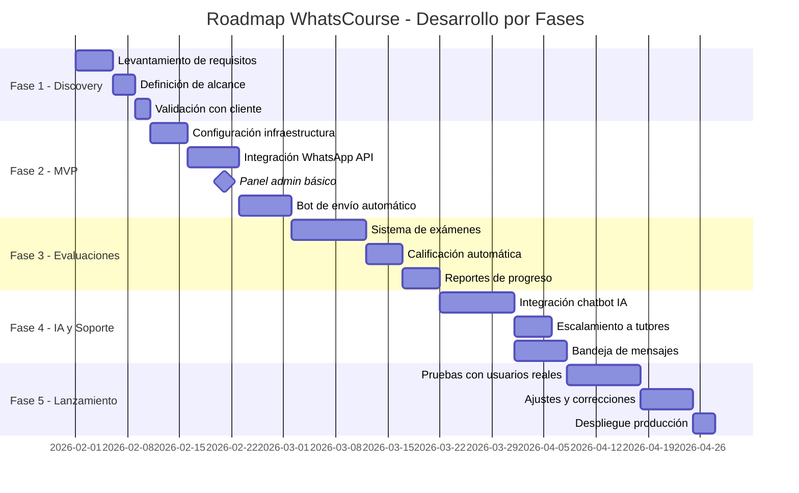
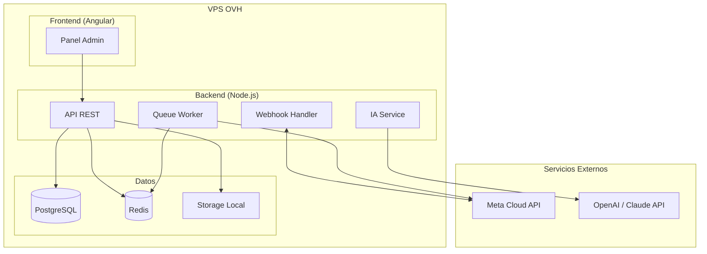
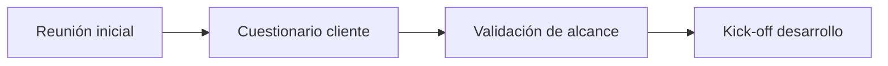
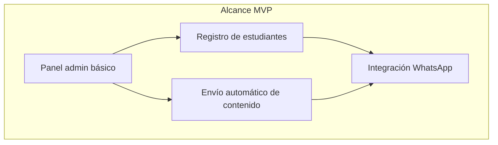
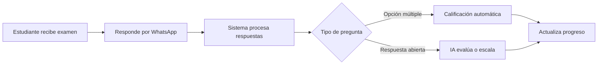
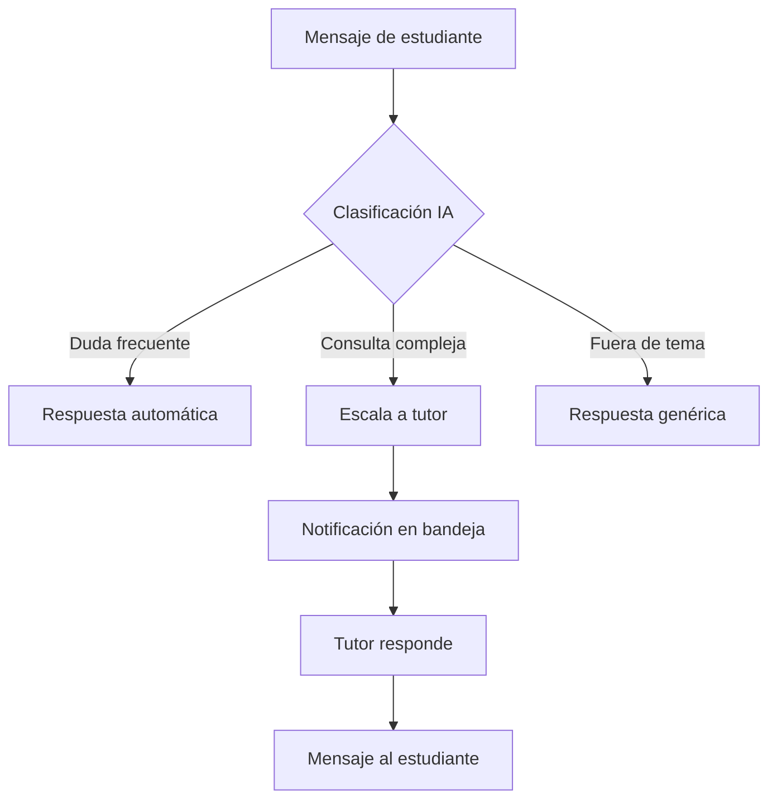
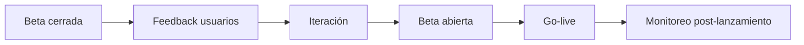
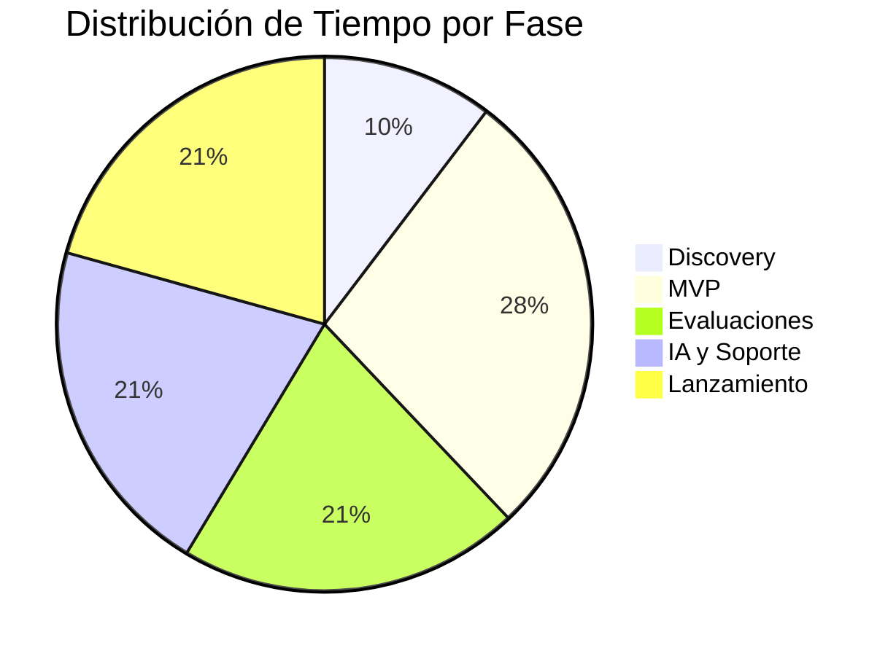

# Roadmap del Proyecto WhatsCourse

## Visión General

---

## Stack Tecnológico

### Decisiones Técnicas

| Componente | Decisión | Justificación |
|------------|----------|---------------|
| **WhatsApp API** | Meta Cloud API | Oficial de Meta, sin intermediarios, mejor precio a escala (~$0.05/conversación) |
| **Backend** | Node.js + Express | Async nativo, ideal para webhooks y eventos en tiempo real |
| **Base de datos** | PostgreSQL | Relacional, robusto, soporte JSON para flexibilidad |
| **Panel Admin** | Angular + TailwindCSS | Framework robusto, tipado fuerte, arquitectura escalable |
| **Automatización** | Bull Queue (Redis) | Programación de envíos, reintentos automáticos, escalable |
| **IA Conversacional** | OpenAI GPT-4 / Claude | Mejor calidad de respuesta para contexto educativo (alternativas más baratas: Mistral, Llama 3) |
| **Infraestructura** | VPS en OVH | Control total, costo fijo predecible, sin vendor lock-in |
| **Almacenamiento** | Disco VPS + Backups OVH | Archivos en servidor, backups automáticos |
| **Autenticación** | JWT + bcrypt | Stateless, estándar de la industria |

### Arquitectura

### Costos Estimados Mensuales

| Servicio | Costo | Notas |
|----------|-------|-------|
| VPS OVH (4GB RAM, 2 vCPU) | ~€15-25/mes | Suficiente para MVP y escala inicial |
| Meta WhatsApp API | Variable | ~$0.05-0.08 por conversación/24h |
| OpenAI API | $20-100/mes | Según volumen de consultas IA |
| Dominio + SSL | ~€10-15/año | Let's Encrypt gratuito |
| **Total estimado** | **€35-125/mes** | Para ~500 usuarios activos |

> **Nota:** Si el volumen de IA es alto, considerar Mistral o Llama 3 self-hosted para reducir costos.

---

## Detalle por Fase

### Fase 1: Discovery y Planificación (1.5 semanas)

| Entregable | Descripción |
|------------|-------------|
| Respuestas del cliente | Volumen, contenido, cuenta WhatsApp |
| Documento de alcance | Funcionalidades priorizadas |
| Ambiente de desarrollo | Repos, CI/CD, VPS staging |

---

### Fase 2: MVP - Producto Mínimo Viable (4 semanas)

**Funcionalidades del MVP:**
- Carga de estudiantes (manual + CSV)
- Creación de cursos con lecciones
- Programación de envío de contenido (drip)
- Vista de estudiantes por curso
- Conexión con WhatsApp Business API

**Criterio de éxito:** Un curso completo funcionando end-to-end con 10 estudiantes de prueba.

---

### Fase 3: Sistema de Evaluaciones (3 semanas)

| Tipo de Evaluación | Prioridad | Fase |
|--------------------|-----------|------|
| Opción múltiple | Alta | 3 |
| Verdadero/Falso | Alta | 3 |
| Respuesta corta con IA | Media | 4 |
| Casos prácticos | Baja | Futuro |

---

### Fase 4: IA Conversacional y Soporte (3 semanas)

**Componentes:**
- Chatbot basado en LLM (GPT-4 / Claude)
- Base de conocimiento por curso
- Sistema de escalamiento inteligente
- Bandeja unificada para tutores

---

### Fase 5: Pruebas y Lanzamiento (3 semanas)

| Actividad | Duración | Participantes |
|-----------|----------|---------------|
| Beta cerrada | 1 semana | 1 empresa, 20 usuarios |
| Ajustes | 1 semana | Equipo desarrollo |
| Lanzamiento | 3 días | Cliente + soporte |

---

## Estimación de Tiempos Total

| Fase | Duración | Acumulado |
|------|----------|-----------|
| Discovery | 1.5 semanas | 1.5 semanas |
| MVP | 4 semanas | 5.5 semanas |
| Evaluaciones | 3 semanas | 8.5 semanas |
| IA y Soporte | 3 semanas | 11.5 semanas |
| Lanzamiento | 3 semanas | **14.5 semanas** |

**Tiempo total estimado: ~3.5 meses**

---

## Dependencias Críticas

| Dependencia | Responsable | Impacto si falta |
|-------------|-------------|------------------|
| Cuenta WhatsApp Business verificada | Cliente | Bloquea Fase 2 |
| Contenido de cursos (videos/PDFs) | Cliente | Bloquea pruebas |
| Definición de evaluaciones | Cliente | Bloquea Fase 3 |
| Acceso a tutores para pruebas | Cliente | Bloquea Fase 4 |

---

## Próximos Pasos

1. Completar cuestionario del cliente (`client-questions.md`)
2. Validar presupuesto y tiempos
3. Firmar contrato / orden de trabajo
4. Kick-off del proyecto
