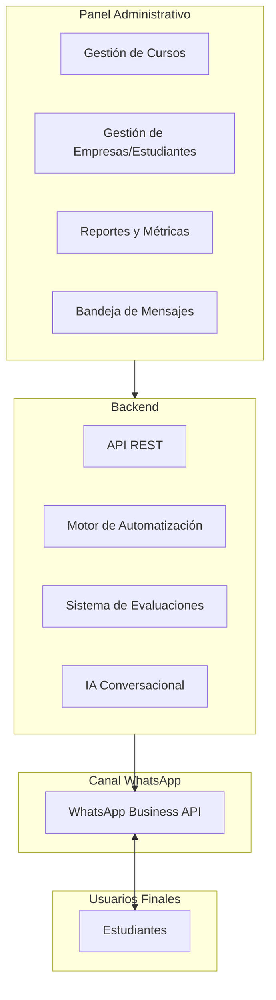
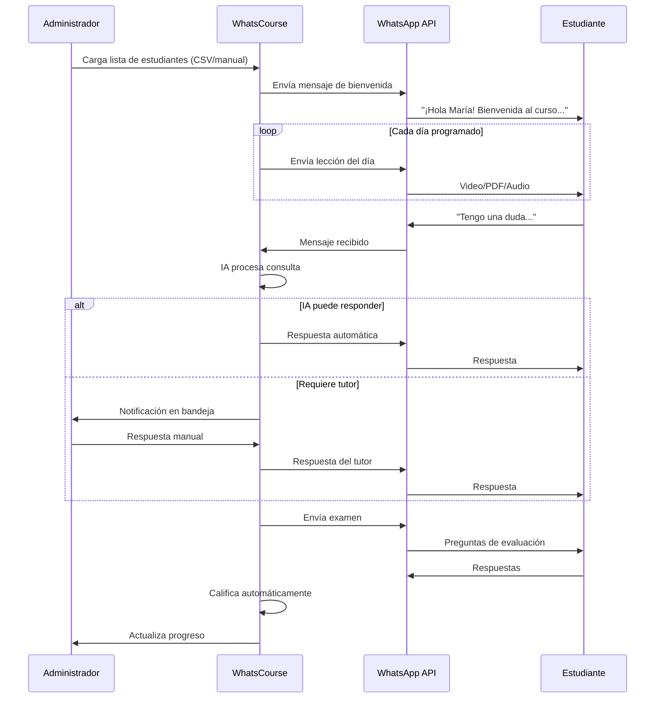

# Propuesta de Proyecto: Plataforma de Cursos vía WhatsApp ("WhatsCourse")

## 1. Resumen Ejecutivo

Esta propuesta detalla el desarrollo de una plataforma educativa que utiliza WhatsApp como canal principal de entrega de contenido. El objetivo es aprovechar la alta tasa de apertura de WhatsApp para ofrecer micro-aprendizaje (micro-learning) mediante videos, audios y PDFs, combinando la escalabilidad de la automatización con la calidez del soporte humano.

---

## 2. Modelo de Negocio

### 2.1 Contexto del Cliente
El cliente vende cursos y capacitaciones a empresas. El modelo B2B funciona así:
- El cliente ofrece un curso/capacitación a una empresa
- La empresa contrata un paquete para sus empleados (ej: 30 empleados)
- Los empleados acceden a los cursos desde su WhatsApp personal

### 2.2 Alcance del Proyecto

| Incluido | Excluido |
|----------|----------|
| Plataforma de gestión de cursos | Pasarela de pagos (ya resuelta por el cliente) |
| Panel administrativo para seguimiento | CRM de ventas |
| Sistema de evaluaciones | |
| Integración con WhatsApp Business API | |

### 2.3 Funcionalidades Clave

1. **Panel Administrativo:** Seguimiento de cursos por empresa, progreso por estudiante, estado de aprobación
2. **Sistema de Evaluación:** Exámenes tipo pregunta/respuesta para validar conocimiento
3. **Soporte Híbrido:** Interacción inicial con IA, escalamiento a tutor humano cuando sea necesario
4. **Métricas y Reportes:** Dashboard con KPIs de avance y completitud

---

## 3. Evaluación Técnica Pendiente

| Decisión | Opciones a Evaluar |
|----------|---------------------|
| Plataforma web administrativa | Chatwoot + n8n vs. Desarrollo a medida |
| Infraestructura | Servidores dedicados vs. Cloud (AWS/GCP) |
| WhatsApp API | Twilio vs. 360dialog vs. Meta Cloud API |

> **Nota:** Ver documento `roadmap.md` para cronograma detallado y `client-questions.md` para preguntas al cliente.

---

## 4. Modelo de Interacción: Híbrido

Para garantizar calidad educativa sin perder escalabilidad:

| Componente | Tipo | Descripción |
|------------|------|-------------|
| **Entrega de Contenido** | Automatizada | Bot envía lecciones en horarios programados (ej: 8:00 AM) |
| **Resolución de Dudas** | IA + Humano | Chatbot IA responde inicialmente; escala a tutor si es necesario |
| **Evaluaciones** | Automatizada | Exámenes con calificación automática |
| **Seguimiento** | Panel Web | Dashboard para administradores |

**Ejemplo de mensaje automático:**
> "¡Buenos días! Aquí tienes la lección de hoy sobre 'Finanzas Personales' 📄 [PDF] + 🎥 [Video]"

---

## 5. Arquitectura del Sistema

---

## 6. Flujo de Usuario

---

## 7. Propuesta de Tipos de Evaluación

| Tipo | Descripción | Automatizable |
|------|-------------|---------------|
| **Opción múltiple** | Preguntas con 4 opciones, una correcta | ✅ Sí |
| **Verdadero/Falso** | Afirmaciones a validar | ✅ Sí |
| **Respuesta corta** | Palabras clave esperadas | ✅ Parcial (IA) |
| **Escala Likert** | Autoevaluación 1-5 | ✅ Sí |
| **Caso práctico** | Análisis de situación | ❌ Requiere tutor |

---

## 8. Documentos Relacionados

| Documento | Descripción |
|-----------|-------------|
| `roadmap.md` | Cronograma de desarrollo por fases |
| `client-questions.md` | Cuestionario para levantamiento de información |
