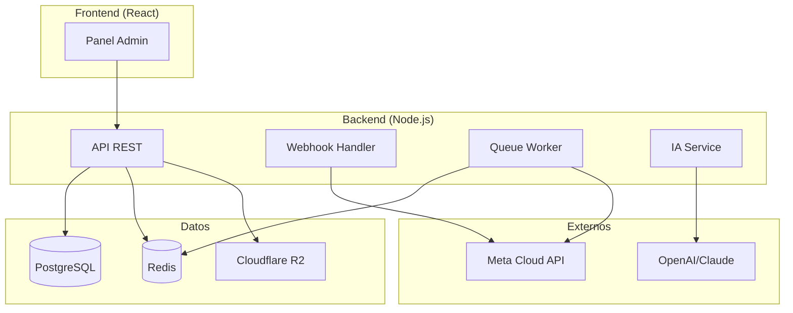
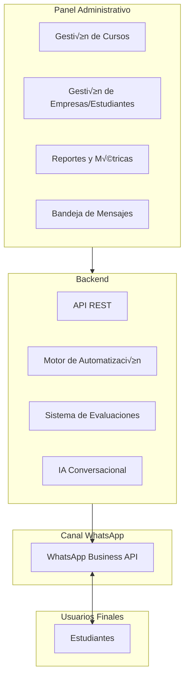
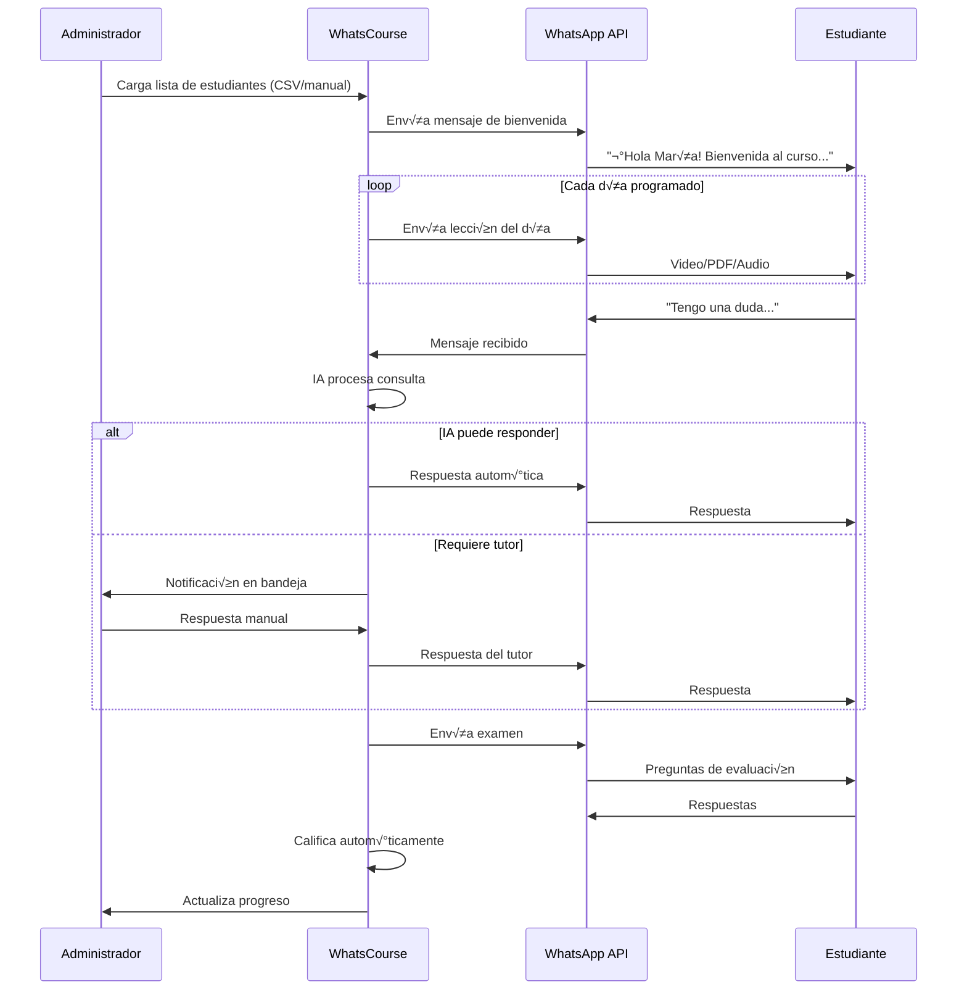

# Propuesta de Proyecto: Plataforma de Cursos vía WhatsApp ("WhatsCourse")

## 1. Resumen Ejecutivo

Esta propuesta detalla el desarrollo de una plataforma educativa que utiliza WhatsApp como canal principal de entrega de contenido. El objetivo es aprovechar la alta tasa de apertura de WhatsApp para ofrecer micro-aprendizaje (micro-learning) mediante videos, audios y PDFs, combinando la escalabilidad de la automatización con la calidez del soporte humano.

---

## 2. Modelo de Negocio

### 2.1 Contexto del Cliente
El cliente vende cursos y capacitaciones a empresas. El modelo B2B funciona así:
- El cliente ofrece un curso/capacitación a una empresa
- La empresa contrata un paquete para sus empleados (ej: 30 empleados)
- Los empleados acceden a los cursos desde su WhatsApp personal

### 2.2 Alcance del Proyecto

| Incluido | Excluido |
|----------|----------|
| Plataforma de gestión de cursos | Pasarela de pagos (ya resuelta por el cliente) |
| Panel administrativo para seguimiento | CRM de ventas |
| Sistema de evaluaciones | |
| Integración con WhatsApp Business API | |

### 2.3 Funcionalidades Clave

1. **Panel Administrativo:** Seguimiento de cursos por empresa, progreso por estudiante, estado de aprobación
2. **Sistema de Evaluación:** Exámenes tipo pregunta/respuesta para validar conocimiento
3. **Soporte Híbrido:** Interacción inicial con IA, escalamiento a tutor humano cuando sea necesario
4. **Métricas y Reportes:** Dashboard con KPIs de avance y completitud

---

## 3. Stack Tecnológico

### 3.1 Decisiones Técnicas

| Componente | Decisión | Justificación |
|------------|----------|---------------|
| **WhatsApp API** | Meta Cloud API | Oficial, sin intermediarios, mejor precio a escala |
| **Backend** | Node.js + Express | Async nativo, ideal para webhooks y real-time |
| **Base de datos** | PostgreSQL | Relacional, robusto, soporte JSON para flexibilidad |
| **Panel Admin** | React + TailwindCSS | Desarrollo r√°pido, componentes reutilizables |
| **Automatización** | Bull Queue (Redis) | Programación de envíos, reintentos, escalable |
| **IA Conversacional** | OpenAI GPT-4 / Claude | RAG con contexto del curso |
| **Infraestructura** | Railway / Render | Deploy simple, escalado autom√°tico, costo predecible |
| **Almacenamiento** | Cloudflare R2 | Compatible S3, económico, CDN global |
| **Autenticación** | JWT + bcrypt | Simple, stateless, estándar |

### 3.2 Arquitectura Simplificada

```mermaid
flowchart TB
    subgraph FRONTEND["Frontend (React)"]
        F1[Panel Admin]
    end
    
    subgraph BACKEND["Backend (Node.js)"]
        B1[API REST]
        B2[Webhook Handler]
        B3[Queue Worker]
        B4[IA Service]
    end
    
    subgraph DATA["Datos"]
        D1[(PostgreSQL)]
        D2[(Redis)]
        D3[Cloudflare R2]
    end
    
    subgraph EXTERNAL["Externos"]
        E1[Meta Cloud API]
        E2[OpenAI/Claude]
    end
    
    F1 --> B1
    B1 --> D1
    B1 --> D2
    B1 --> D3
    B2 --> E1
    B3 --> D2
    B3 --> E1
    B4 --> E2
```

### 3.3 Costos Estimados Mensuales

| Servicio | Costo Base | Escala |
|----------|------------|--------|
| Railway/Render | $20-50 | Por uso |
| PostgreSQL (managed) | $15-25 | Incluido o Supabase |
| Redis | $10-15 | Upstash (serverless) |
| Cloudflare R2 | $0-15 | 10GB gratis, luego $0.015/GB |
| Meta WhatsApp API | Variable | ~$0.05-0.08 por conversación/24h |
| OpenAI API | $20-100 | Seg√∫n volumen de consultas |
| **Total estimado** | **$65-205/mes** | Para ~500 usuarios activos |

> **Nota:** Los costos de WhatsApp API dependen del volumen que confirme el cliente. Ver `client-questions.md` para preguntas pendientes.

---

> **Documentos relacionados:** `roadmap.md` para cronograma, `client-questions.md` para información pendiente del cliente.

---

## 4. Modelo de Interacción: Híbrido

Para garantizar calidad educativa sin perder escalabilidad:

| Componente | Tipo | Descripción |
|------------|------|-------------|
| **Entrega de Contenido** | Automatizada | Bot envía lecciones en horarios programados (ej: 8:00 AM) |
| **Resolución de Dudas** | IA + Humano | Chatbot IA responde inicialmente; escala a tutor si es necesario |
| **Evaluaciones** | Automatizada | Exámenes con calificación automática |
| **Seguimiento** | Panel Web | Dashboard para administradores |

**Ejemplo de mensaje autom√°tico:**
> "¡Buenos días! Aquí tienes la lección de hoy sobre 'Finanzas Personales' 📄 [PDF] + 🎥 [Video]"

---

## 5. Arquitectura del Sistema

```mermaid
flowchart TB
    subgraph ADMIN["Panel Administrativo"]
        A1[Gestión de Cursos]
        A2[Gestión de Empresas/Estudiantes]
        A3[Reportes y Métricas]
        A4[Bandeja de Mensajes]
    end
    
    subgraph BACKEND["Backend"]
        B1[API REST]
        B2[Motor de Automatización]
        B3[Sistema de Evaluaciones]
        B4[IA Conversacional]
    end
    
    subgraph WHATSAPP["Canal WhatsApp"]
        W1[WhatsApp Business API]
    end
    
    subgraph USUARIOS["Usuarios Finales"]
        U1[Estudiantes]
    end
    
    ADMIN --> BACKEND
    BACKEND --> W1
    W1 <--> U1
```

---

## 6. Flujo de Usuario

```mermaid
sequenceDiagram
    participant Admin as Administrador
    participant Sistema as WhatsCourse
    participant WA as WhatsApp API
    participant User as Estudiante
    
    Admin->>Sistema: Carga lista de estudiantes (CSV/manual)
    Sistema->>WA: Envía mensaje de bienvenida
    WA->>User: "¡Hola María! Bienvenida al curso..."
    
    loop Cada día programado
        Sistema->>WA: Envía lección del día
        WA->>User: Video/PDF/Audio
    end
    
    User->>WA: "Tengo una duda..."
    WA->>Sistema: Mensaje recibido
    Sistema->>Sistema: IA procesa consulta
    alt IA puede responder
        Sistema->>WA: Respuesta autom√°tica
        WA->>User: Respuesta
    else Requiere tutor
        Sistema->>Admin: Notificación en bandeja
        Admin->>Sistema: Respuesta manual
        Sistema->>WA: Respuesta del tutor
        WA->>User: Respuesta
    end
    
    Sistema->>WA: Envía examen
    WA->>User: Preguntas de evaluación
    User->>WA: Respuestas
    Sistema->>Sistema: Califica autom√°ticamente
    Sistema->>Admin: Actualiza progreso
```

---

## 7. Propuesta de Tipos de Evaluación

| Tipo | Descripción | Automatizable |
|------|-------------|---------------|
| **Opción múltiple** | Preguntas con 4 opciones, una correcta | ✅ Sí |
| **Verdadero/Falso** | Afirmaciones a validar | ✅ Sí |
| **Respuesta corta** | Palabras clave esperadas | ‚úÖ Parcial (IA) |
| **Escala Likert** | Autoevaluación 1-5 | ✅ Sí |
| **Caso práctico** | Análisis de situación | ❌ Requiere tutor |

---

## 8. Documentos Relacionados

| Documento | Descripción |
|-----------|-------------|
| `roadmap.md` | Cronograma de desarrollo por fases |
| `client-questions.md` | Cuestionario para levantamiento de información |
