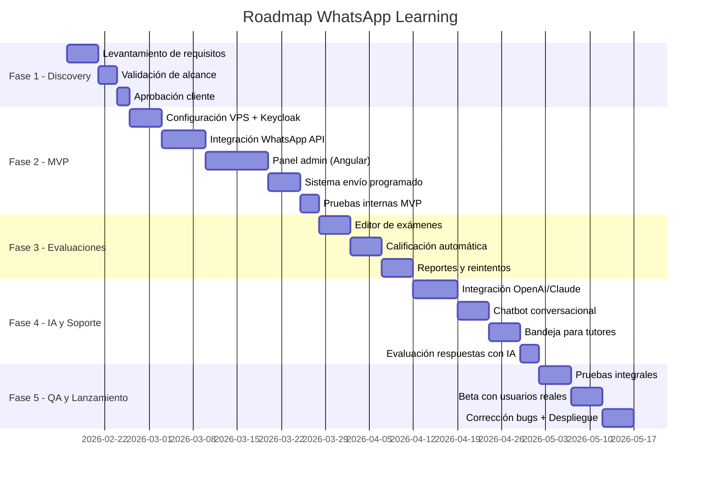
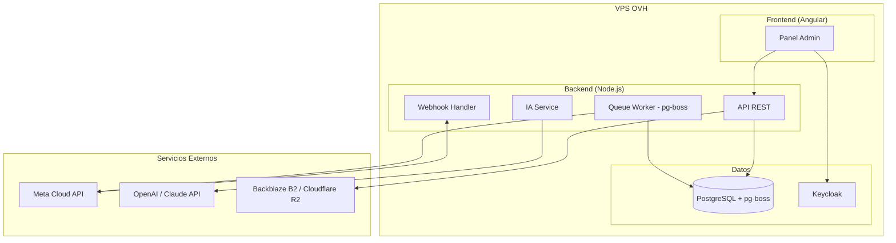
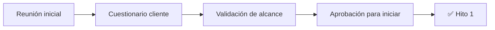
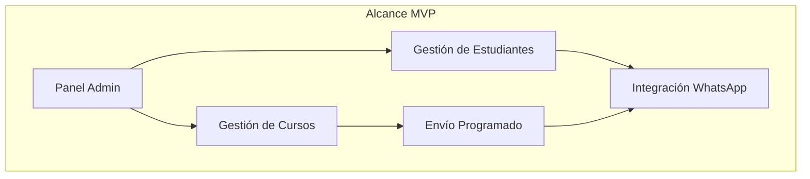
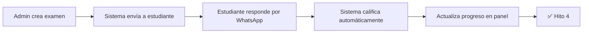
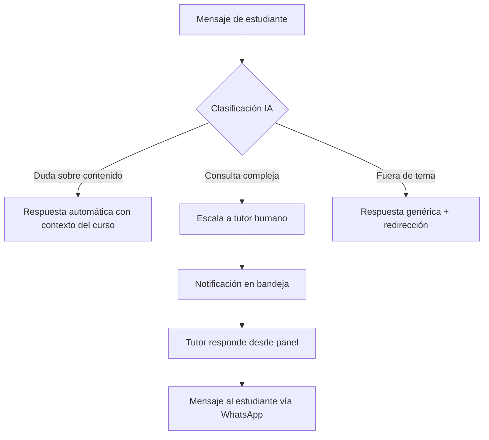
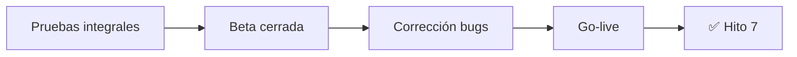
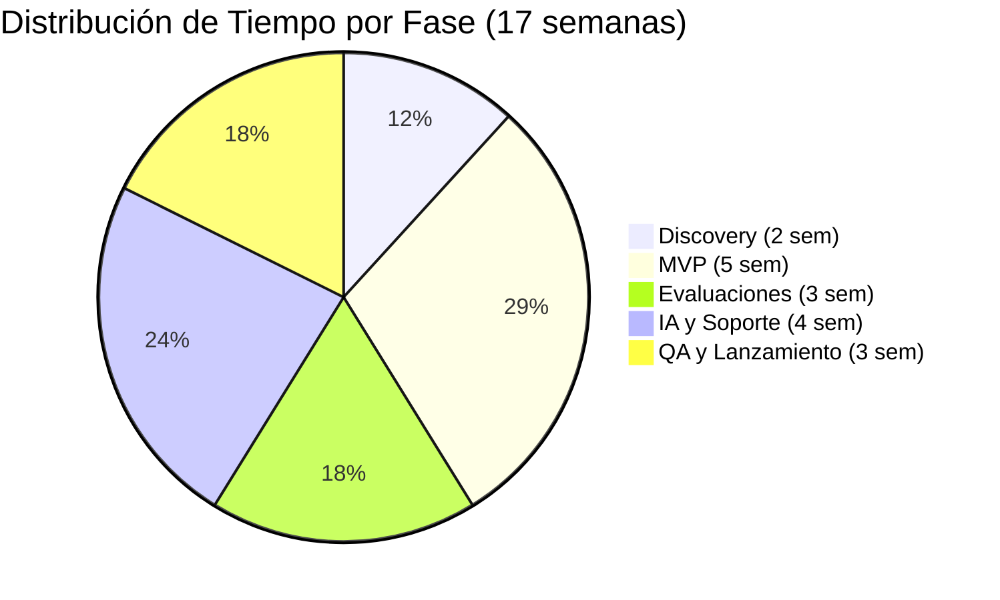

# Roadmap del Proyecto WhatsApp Learning

## Visión General

---

## Hitos y Entregables para el Cliente

> Cada hito es un **entregable demostrable** que el cliente puede observar y validar. Se programan cada **2-3 semanas**.

| Hito | Semana | Qué puede observar el cliente |
|------|--------|-------------------------------|
| **Hito 1** | Semana 2 | Documento de alcance firmado, cronograma acordado.
| **Hito 2** | Semana 5 | **Login funcional**, panel admin con gestión de cursos y estudiantes, infraestructura WhatsApp conectada |
| **Hito 3** | Semana 7 | **MVP completo**: envío de lecciones por WhatsApp a estudiantes de prueba, vista de progreso en panel |
| **Hito 4** | Semana 10 | **Evaluaciones funcionando**: crear exámenes desde panel, estudiantes responden por WhatsApp, calificación automática, reportes de notas |
| **Hito 5** | Semana 12 | **Chatbot IA respondiendo**: estudiantes hacen preguntas por WhatsApp y reciben respuestas contextuales del curso |
| **Hito 6** | Semana 14 | **IA completa**: bandeja de tutores para mensajes escalados, evaluación de respuestas abiertas con IA |
| **Hito 7** | Semana 17 | **Plataforma en producción**: desplegada, estable, con beta cerrada completada y bugs corregidos |

---

## Equipo Mínimo Requerido

El equipo es:

| Rol | Dedicación | Responsabilidades |
|-----|------------|-------------------|
| **Backend / DevOps Senior** | 100% (tiempo completo) | API REST, integración WhatsApp, IA (RAG + LLM), infraestructura VPS, CI/CD |
| **Frontend Developer** | 100% (tiempo completo) | Panel admin Angular, UX/UI, reportes, bandeja de tutores |
| **QA / Tester** | 50% fases 1-4 → 100% fase 5 | Pruebas funcionales, casos borde, beta, regresión |
| **Project Manager / Líder técnico** | ~30% (parcial) | Coordinación con cliente, seguimiento de hitos, gestión de riesgos |

> **Resumen:** Mínimo **3 personas a tiempo completo + 1 PM parcial**. Los 2 desarrolladores trabajan en paralelo (backend + frontend) lo cual es clave para cumplir los plazos.

> ⚠️ **Riesgo:** Al eliminar el buffer de contingencia, cualquier retraso significativo (cambios de alcance, bugs complejos, retrasos del cliente en entregables) impactará directamente la fecha de entrega. Se recomienda disciplina estricta en la gestión de cambios.

---

## Stack Tecnológico

### Decisiones Técnicas

| Componente | Decisión | Justificación |
|------------|----------|---------------|
| **WhatsApp API** | Meta Cloud API | Oficial de Meta, sin intermediarios, mejor precio a escala (~$0.05/conversación) |
| **Backend** | Node.js + Express | Async nativo, ideal para webhooks y eventos en tiempo real |
| **Base de datos** | PostgreSQL | Relacional, robusto, soporte JSON para flexibilidad |
| **Panel Admin** | Angular + TailwindCSS | Framework robusto, tipado fuerte, arquitectura escalable |
| **Colas/Tareas** | pg-boss (PostgreSQL) | Usa la misma DB, sin servicio extra, suficiente para este volumen |
| **IA Conversacional** | OpenAI GPT-4 / Claude | Mejor calidad de respuesta para contexto educativo (alternativas más baratas: Mistral, Llama 3) |
| **Infraestructura** | VPS en OVH | Control total, costo fijo predecible, sin vendor lock-in |
| **Almacenamiento** | Backblaze B2 o Cloudflare R2 | Cloud especializado, económico (~$0.005/GB), CDN incluido, compatible S3 |
| **Autenticación** | Keycloak | SSO, gestión de roles, escalable a múltiples empresas cliente, estándar enterprise |

### Arquitectura

### Costos Estimados Mensuales

| Servicio | Costo | Notas |
|----------|-------|-------|
| VPS OVH (8GB RAM, 4 vCPU) | ~€25-40/mes | Keycloak requiere más RAM |
| Backblaze B2 / Cloudflare R2 | ~€5-15/mes | ~$0.005/GB, 10GB gratis en R2 |
| Meta WhatsApp API | Variable | ~$0.05-0.08 por conversación/24h |
| OpenAI API | $20-100/mes | Según volumen de consultas IA |
| Dominio + SSL | ~€10-15/año | Let's Encrypt gratuito |
| **Total estimado** | **€50-155/mes** | Para ~500 usuarios activos |

> **Nota:** Si el volumen de IA es alto, considerar Mistral o Llama 3 self-hosted para reducir costos.

---

## Detalle por Fase

### Fase 1: Discovery y Planificación (2 semanas)

> 📅 **Semanas 1-2** · Finaliza con **Hito 1**

**Desglose semanal:**

| Semana | Actividades |
|--------|-------------|
| **Semana 1** | Reunión de kick-off, entrega de cuestionario al cliente, análisis de requisitos, definición del alcance funcional |
| **Semana 2** | Validación de alcance con cliente, configuración de repositorios Git, pipeline CI/CD, VPS staging, firma del documento de alcance |

**Entregables AL CLIENTE:**

| Entregable | Descripción |
|------------|-------------|
| Documento de alcance firmado | Funcionalidades confirmadas, lo que entra y lo que NO |
| Cronograma acordado | Fechas de entrega por fase e hitos |
| Acceso al entorno staging | URL del entorno de demostración |

**Configuración interna (no entregable):**
- Repositorios Git (monorepo o multi-repo)
- Pipeline CI/CD (GitHub Actions o GitLab CI)
- VPS staging con Docker Compose
- Estructura base del proyecto (backend + frontend)

**Dependencias del cliente:**
- Respuestas al cuestionario (`client-questions.md`)
- Cuenta WhatsApp Business verificada
- Acceso a contenido de ejemplo (1 curso mínimo)

---

### Fase 2: MVP - Producto Mínimo Viable (5 semanas)

> 📅 **Semanas 3-7** · **Hito 2** en semana 5 · **Hito 3** en semana 7

> **Nota:** En esta fase NO hay IA. Los mensajes de estudiantes llegan pero no se responden automáticamente hasta Fase 4.

**Desglose semanal:**

| Semana | Actividades | Hito |
|--------|-------------|------|
| **Semana 3** | Configuración VPS producción, instalación Keycloak, base de datos PostgreSQL, esquema inicial | |
| **Semana 4** | Integración WhatsApp Business API, webhook handler, envío/recepción de mensajes básicos | |
| **Semana 5** | Panel admin Angular: login con Keycloak, CRUD de cursos, CRUD de estudiantes (manual + CSV) | **🟢 Hito 2**: Login + Panel admin funcional |
| **Semana 6** | Sistema de envío programado (drip), motor de colas pg-boss, lógica de goteo de lecciones | |
| **Semana 7** | Pruebas internas del MVP, vista de progreso en panel, envío de curso completo a 10 estudiantes de prueba | **🟢 Hito 3**: MVP completo |

**Funcionalidades del MVP:**

| Funcionalidad | Descripción | Para quién |
|---------------|-------------|------------|
| Carga de estudiantes | Manual + importar CSV con números | Administrador del cliente |
| Creación de cursos | Subir videos, PDFs, audios, definir orden | Administrador del cliente |
| Envío programado ("drip") | Goteo de contenido: envía lección 1 el día 1, lección 2 el día 2, etc. | Automático |
| Vista de progreso | Ver qué estudiantes recibieron qué lección | Administrador del cliente |
| Integración WhatsApp | Conexión técnica: enviar mensajes, recibir confirmación de entrega | Sistema |

**Criterio de éxito Hito 3:** Un curso completo enviado a 10 estudiantes de prueba, con registro de entregas visible en el panel.

**Qué NO incluye esta fase:**
- Responder mensajes de estudiantes (Fase 4)
- Exámenes (Fase 3)
- IA conversacional (Fase 4)

---

### Fase 3: Sistema de Evaluaciones (3 semanas)

> 📅 **Semanas 8-10** · Finaliza con **Hito 4**

> **Nota:** Solo evaluaciones automáticas (opción múltiple, V/F). La evaluación con IA de respuestas abiertas es Fase 4.

**Desglose semanal:**

| Semana | Actividades | Hito |
|--------|-------------|------|
| **Semana 8** | Editor de exámenes en panel (opción múltiple, V/F), asociar exámenes a lecciones/cursos | |
| **Semana 9** | Envío de exámenes por WhatsApp en formato conversacional, motor de calificación automática | |
| **Semana 10** | Reportes de notas (aprobados/reprobados), sistema de reintentos, ajustes de UX del flujo completo | **🟢 Hito 4**: Evaluaciones completas |

**Funcionalidades:**

| Funcionalidad | Tiempo | Descripción |
|---------------|--------|-------------|
| Crear exámenes | 4 días | Editor de preguntas opción múltiple y V/F, banco de preguntas |
| Enviar exámenes | 3 días | Por WhatsApp, formato conversacional interactivo |
| Calificación automática | 4 días | Procesar respuestas, calcular nota, feedback inmediato |
| Reportes de notas | 2 días | Vista de aprobados/reprobados en panel, exportar resultados |
| Reintentos | 2 días | Permitir repetir examen si reprueba, configurar intentos máximos |

**Tipos de evaluación en esta fase:**

| Tipo | Incluido | Calificación |
|------|----------|-------------|
| Opción múltiple | ✅ Sí | Automática |
| Verdadero/Falso | ✅ Sí | Automática |
| Respuesta abierta | ❌ Fase 4 | Con IA |
| Casos prácticos | ❌ Futuro | Manual |

**Criterio de éxito Hito 4:** Un examen creado desde el panel, enviado a estudiantes de prueba por WhatsApp, calificado automáticamente, y resultados visibles en reportes.

---

### Fase 4: IA Conversacional y Soporte (4 semanas)

> 📅 **Semanas 11-14** · **Hito 5** en semana 12 · **Hito 6** en semana 14

**Desglose semanal:**

| Semana | Actividades | Hito |
|--------|-------------|------|
| **Semana 11** | Integración OpenAI/Claude API, manejo de tokens, retry logic, sistema RAG (indexar PDFs de cursos) | |
| **Semana 12** | Chatbot conversacional: respuestas contextuales basadas en contenido del curso, clasificación de mensajes | **🟢 Hito 5**: Chatbot IA respondiendo |
| **Semana 13** | Bandeja de mensajes para tutores: vista de pendientes, asignación, respuesta desde panel (WebSockets) | |
| **Semana 14** | Evaluación de respuestas abiertas con IA, ajustes de prompts, pruebas de calidad de respuestas | **🟢 Hito 6**: IA completa |

**Funcionalidades:**

| Funcionalidad | Tiempo | Descripción |
|---------------|--------|-------------|
| Integración OpenAI/Claude | 7 días | Conexión API, manejo de tokens, retry logic, rate limiting |
| Chatbot conversacional | 5 días | Respuestas contextuales basadas en contenido del curso (RAG) |
| Bandeja para tutores | 5 días | Vista de mensajes pendientes, asignación, respuesta en tiempo real |
| Evaluación respuestas abiertas | 3 días | IA califica respuestas de texto libre con rúbrica configurable |

**Componentes técnicos:**
- **LLM:** OpenAI GPT-4 o Claude (configurable por entorno)
- **RAG:** Base de conocimiento por curso (PDFs indexados con embeddings)
- **Escalamiento:** Reglas configurables + clasificación IA para decidir cuándo escalar a humano
- **Bandeja:** Tiempo real con WebSockets, notificaciones a tutores

**Criterio de éxito Hito 5:** Un estudiante envía una pregunta sobre el contenido del curso y recibe una respuesta contextual correcta del chatbot.

**Criterio de éxito Hito 6:** Bandeja de tutores funcional con mensajes escalados, y evaluación de respuestas abiertas con IA calificando correctamente.

---

### Fase 5: QA y Lanzamiento (3 semanas)

> 📅 **Semanas 15-17** · Finaliza con **Hito 7 (Go-live)**

**Desglose semanal:**

| Semana | Actividades | Hito |
|--------|-------------|------|
| **Semana 15** | QA interno: pruebas de todos los flujos end-to-end, pruebas de carga, seguridad básica, casos borde | |
| **Semana 16** | Beta cerrada con 1 empresa cliente (20-30 usuarios reales), recopilación de feedback | |
| **Semana 17** | Corrección de bugs encontrados en beta, despliegue a producción, DNS, monitoreo post-deploy | **🟢 Hito 7**: Go-live |

| Actividad | Duración | Descripción |
|-----------|----------|-------------|
| Pruebas integrales | 5 días | QA interno: todos los flujos, casos borde, pruebas de carga |
| Beta cerrada | 5 días | 1 empresa cliente, 20-30 usuarios reales, feedback directo |
| Corrección bugs + Despliegue | 5 días | Fixes de issues encontrados en beta, migración prod, DNS, monitoreo |

**Criterio de éxito Hito 7:** Plataforma desplegada en producción, estable, con al menos 1 curso completo funcional y validado por usuarios reales.

---

## Estimación de Tiempos Total

| Fase | Duración | Acumulado | Qué incluye | Hitos |
|------|----------|-----------|-------------|-------|
| Discovery | 2 semanas | 2 sem | Requisitos, alcance, aprobación, setup técnico | Hito 1 |
| MVP | 5 semanas | 7 sem | Panel, cursos, envío WhatsApp, progreso | Hitos 2, 3 |
| Evaluaciones | 3 semanas | 10 sem | Exámenes opción múltiple, calificación, reportes, reintentos | Hito 4 |
| IA y Soporte | 4 semanas | 14 sem | Chatbot, bandeja tutores, IA eval respuestas abiertas | Hitos 5, 6 |
| QA y Lanzamiento | 3 semanas | 17 sem | Pruebas, beta, fixes, deploy producción | Hito 7 |

**Tiempo total: 17 semanas (~4 meses)**

> ⚠️ **Importante:** Este cronograma no incluye buffer de contingencia. Requiere que el cliente entregue sus dependencias a tiempo (cuenta WhatsApp, contenido de cursos, definición de evaluaciones) y que no haya cambios significativos de alcance durante el desarrollo.

---

## Dependencias Críticas

| Dependencia | Responsable | Cuándo se necesita | Impacto si falta |
|-------------|-------------|-------------------|------------------|
| Cuenta WhatsApp Business verificada | Cliente | Antes de Semana 3 | Bloquea Fase 2 completa |
| Contenido de cursos (videos/PDFs) | Cliente | Antes de Semana 5 | Bloquea pruebas del MVP |
| Definición de evaluaciones | Cliente | Antes de Semana 8 | Bloquea Fase 3 |
| Acceso a tutores para pruebas | Cliente | Antes de Semana 13 | Bloquea pruebas de bandeja |
| Empresa para beta cerrada | Cliente | Antes de Semana 16 | Bloquea beta de Fase 5 |

---

## Próximos Pasos

1. Completar cuestionario del cliente (`client-questions.md`)
2. Validar presupuesto y tiempos
3. Firmar contrato / orden de trabajo
4. Kick-off del proyecto (inicio Semana 1)
