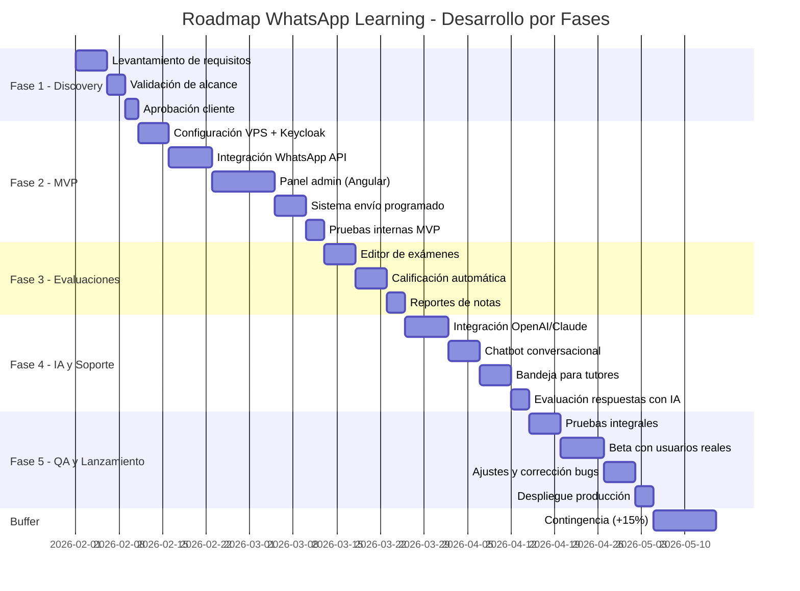
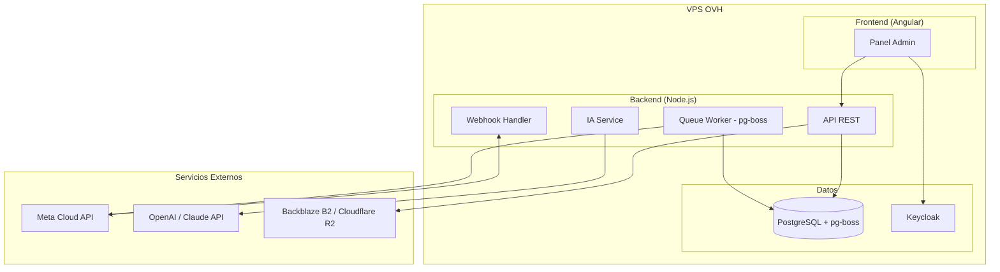
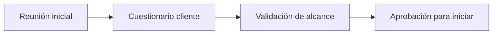
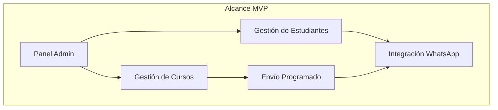
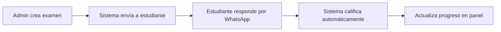
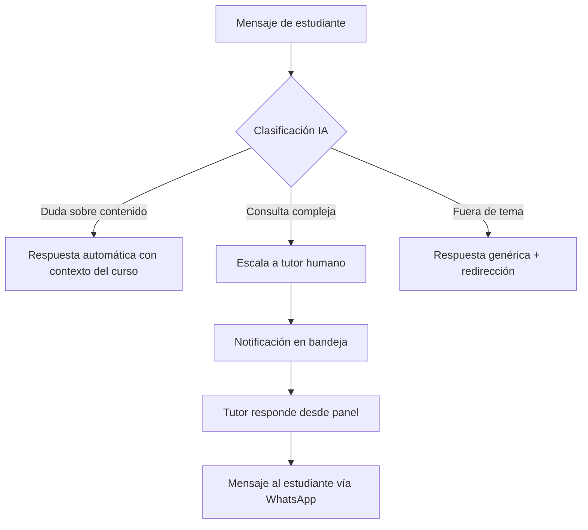
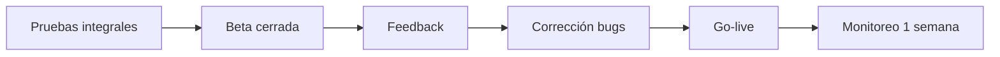
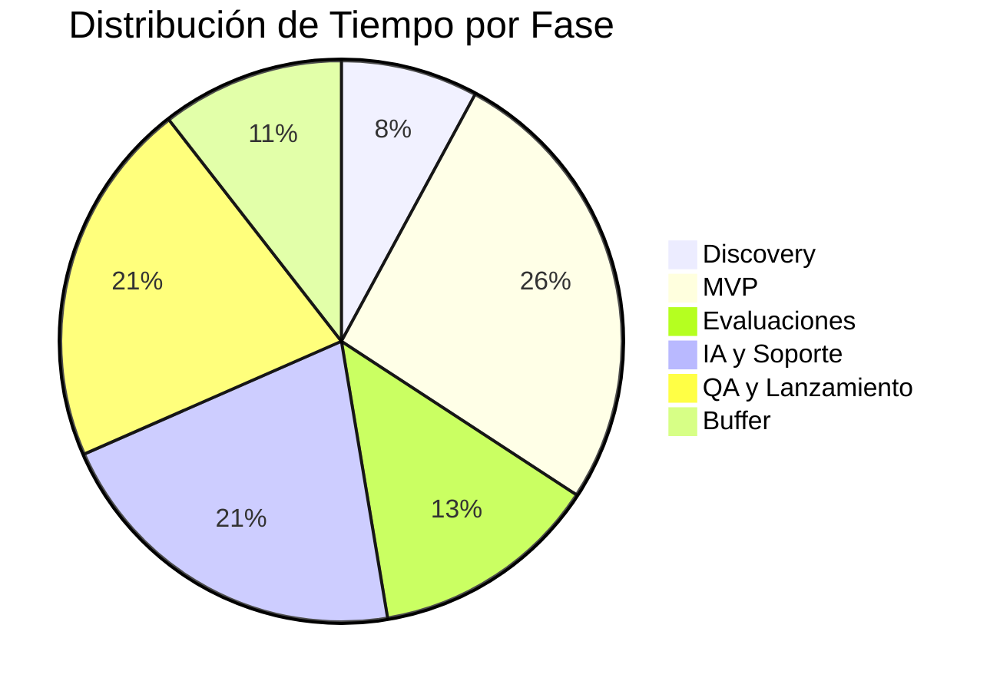

# Roadmap del Proyecto WhatsApp Learning

## Visión General

---

## Stack Tecnológico

### Decisiones Técnicas

| Componente | Decisión | Justificación |
|------------|----------|---------------|
| **WhatsApp API** | Meta Cloud API | Oficial de Meta, sin intermediarios, mejor precio a escala (~$0.05/conversación) |
| **Backend** | Node.js + Express | Async nativo, ideal para webhooks y eventos en tiempo real |
| **Base de datos** | PostgreSQL | Relacional, robusto, soporte JSON para flexibilidad |
| **Panel Admin** | Angular + TailwindCSS | Framework robusto, tipado fuerte, arquitectura escalable |
| **Colas/Tareas** | pg-boss (PostgreSQL) | Usa la misma DB, sin servicio extra, suficiente para este volumen |
| **IA Conversacional** | OpenAI GPT-4 / Claude | Mejor calidad de respuesta para contexto educativo (alternativas más baratas: Mistral, Llama 3) |
| **Infraestructura** | VPS en OVH | Control total, costo fijo predecible, sin vendor lock-in |
| **Almacenamiento** | Backblaze B2 o Cloudflare R2 | Cloud especializado, económico (~$0.005/GB), CDN incluido, compatible S3 |
| **Autenticación** | Keycloak | SSO, gestión de roles, escalable a múltiples empresas cliente, estándar enterprise |

### Arquitectura

### Costos Estimados Mensuales

| Servicio | Costo | Notas |
|----------|-------|-------|
| VPS OVH (8GB RAM, 4 vCPU) | ~€25-40/mes | Keycloak requiere más RAM |
| Backblaze B2 / Cloudflare R2 | ~€5-15/mes | ~$0.005/GB, 10GB gratis en R2 |
| Meta WhatsApp API | Variable | ~$0.05-0.08 por conversación/24h |
| OpenAI API | $20-100/mes | Según volumen de consultas IA |
| Dominio + SSL | ~€10-15/año | Let's Encrypt gratuito |
| **Total estimado** | **€50-155/mes** | Para ~500 usuarios activos |

> **Nota:** Si el volumen de IA es alto, considerar Mistral o Llama 3 self-hosted para reducir costos.

---

## Detalle por Fase

### Fase 1: Discovery y Planificación (1.5 semanas)

**Entregables AL CLIENTE:**

| Entregable | Descripción |
|------------|-------------|
| Documento de alcance firmado | Funcionalidades confirmadas, lo que entra y lo que NO |
| Cronograma acordado | Fechas de entrega por fase |

**Configuración interna (no entregable):**
- Repositorios Git
- Pipeline CI/CD
- VPS staging

**Dependencias del cliente:**
- Respuestas al cuestionario (`client-questions.md`)
- Cuenta WhatsApp Business verificada
- Acceso a contenido de ejemplo (1 curso mínimo)

---

### Fase 2: MVP - Producto Mínimo Viable (5 semanas)

> **Nota:** En esta fase NO hay IA. Los mensajes de estudiantes llegan pero no se responden automáticamente hasta Fase 4.

**Funcionalidades del MVP:**

| Funcionalidad | Descripción | Para quién |
|---------------|-------------|------------|
| Carga de estudiantes | Manual + importar CSV con números | Administrador del cliente |
| Creación de cursos | Subir videos, PDFs, audios, definir orden | Administrador del cliente |
| Envío programado ("drip") | Goteo de contenido: envía lección 1 el día 1, lección 2 el día 2, etc. | Automático |
| Vista de progreso | Ver qué estudiantes recibieron qué lección | Administrador del cliente |
| Integración WhatsApp | Conexión técnica: enviar mensajes, recibir confirmación de entrega | Sistema |

**Criterio de éxito:** Un curso completo enviado a 10 estudiantes de prueba, con registro de entregas.

**Qué NO incluye esta fase:**
- Responder mensajes de estudiantes (Fase 4)
- Exámenes (Fase 3)
- IA conversacional (Fase 4)

---

### Fase 3: Sistema de Evaluaciones (2.5 semanas)

> **Nota:** Solo evaluaciones automáticas (opción múltiple, V/F). La evaluación con IA de respuestas abiertas es Fase 4.

**Funcionalidades:**

| Funcionalidad | Tiempo | Descripción |
|---------------|--------|-------------|
| Crear exámenes | 3 días | Editor de preguntas opción múltiple y V/F |
| Enviar exámenes | 2 días | Por WhatsApp, formato conversacional |
| Calificación automática | 3 días | Procesar respuestas, calcular nota |
| Reportes de notas | 2 días | Vista de aprobados/reprobados en panel |
| Reintentos | 2 días | Permitir repetir examen si reprueba |

**Tipos de evaluación en esta fase:**

| Tipo | Incluido | Calificación |
|------|----------|-------------|
| Opción múltiple | ✅ Sí | Automática |
| Verdadero/Falso | ✅ Sí | Automática |
| Respuesta abierta | ❌ Fase 4 | Con IA |
| Casos prácticos | ❌ Futuro | Manual |

---

### Fase 4: IA Conversacional y Soporte (4 semanas)

**Funcionalidades:**

| Funcionalidad | Tiempo | Descripción |
|---------------|--------|-------------|
| Integración OpenAI/Claude | 7 días | Conexión API, manejo de tokens, retry logic |
| Chatbot conversacional | 5 días | Respuestas contextuales basadas en contenido del curso |
| Bandeja para tutores | 5 días | Vista de mensajes pendientes, asignación, respuesta |
| Evaluación respuestas abiertas | 3 días | IA califica respuestas de texto libre |

**Componentes técnicos:**
- LLM: OpenAI GPT-4 o Claude (configurable)
- RAG: Base de conocimiento por curso (PDFs indexados)
- Escalamiento: Reglas + clasificación IA
- Bandeja: Tiempo real con WebSockets

---

### Fase 5: QA y Lanzamiento (4 semanas)

| Actividad | Duración | Descripción |
|-----------|----------|-------------|
| Pruebas integrales | 5 días | QA interno: todos los flujos, casos borde |
| Beta cerrada | 7 días | 1 empresa cliente, 20-30 usuarios reales |
| Corrección bugs | 5 días | Fixes de issues encontrados en beta |
| Despliegue producción | 3 días | Migración, DNS, monitoreo |

---

## Estimación de Tiempos Total

| Fase | Duración | Acumulado | Qué incluye |
|------|----------|-----------|-------------|
| Discovery | 1.5 semanas | 1.5 sem | Requisitos, alcance, aprobación |
| MVP | 5 semanas | 6.5 sem | Panel, cursos, envío WhatsApp |
| Evaluaciones | 2.5 semanas | 9 sem | Exámenes opción múltiple, notas |
| IA y Soporte | 4 semanas | 13 sem | Chatbot, bandeja tutores, IA eval |
| QA y Lanzamiento | 4 semanas | 17 sem | Pruebas, beta, fixes, deploy |
| **Buffer (+15%)** | 2 semanas | **19 sem** | Contingencia para imprevistos |

**Tiempo total estimado: ~4.5 meses (19 semanas)**

> ⚠️ **Importante:** El buffer es para imprevistos reales (bugs complejos, cambios de requisitos menores, retrasos del cliente). No es tiempo "extra" para agregar funcionalidades.

---

## Dependencias Críticas

| Dependencia | Responsable | Impacto si falta |
|-------------|-------------|------------------|
| Cuenta WhatsApp Business verificada | Cliente | Bloquea Fase 2 |
| Contenido de cursos (videos/PDFs) | Cliente | Bloquea pruebas |
| Definición de evaluaciones | Cliente | Bloquea Fase 3 |
| Acceso a tutores para pruebas | Cliente | Bloquea Fase 4 |

---

## Próximos Pasos

1. Completar cuestionario del cliente (`client-questions.md`)
2. Validar presupuesto y tiempos
3. Firmar contrato / orden de trabajo
4. Kick-off del proyecto
